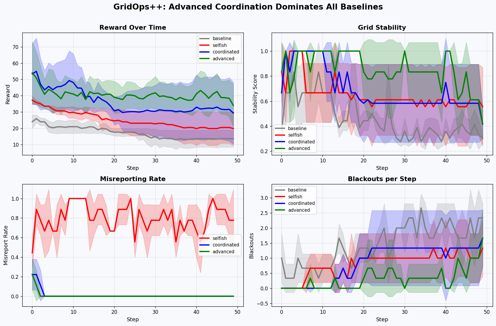
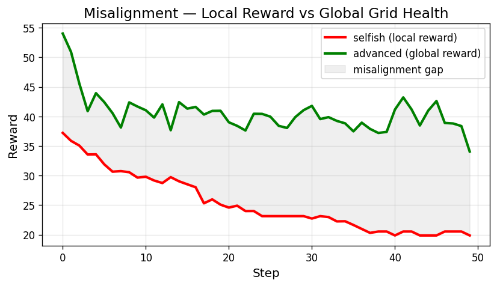
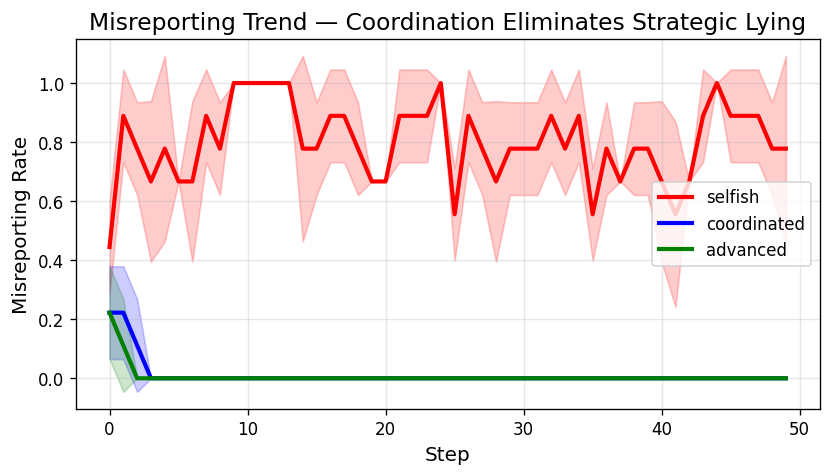
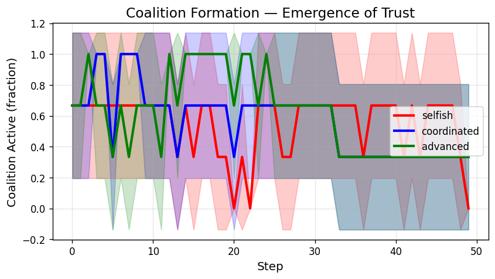
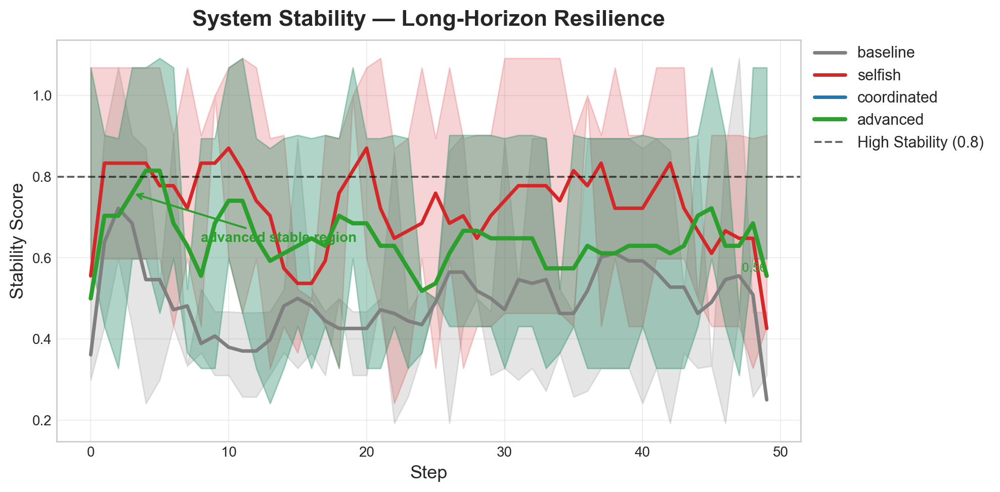
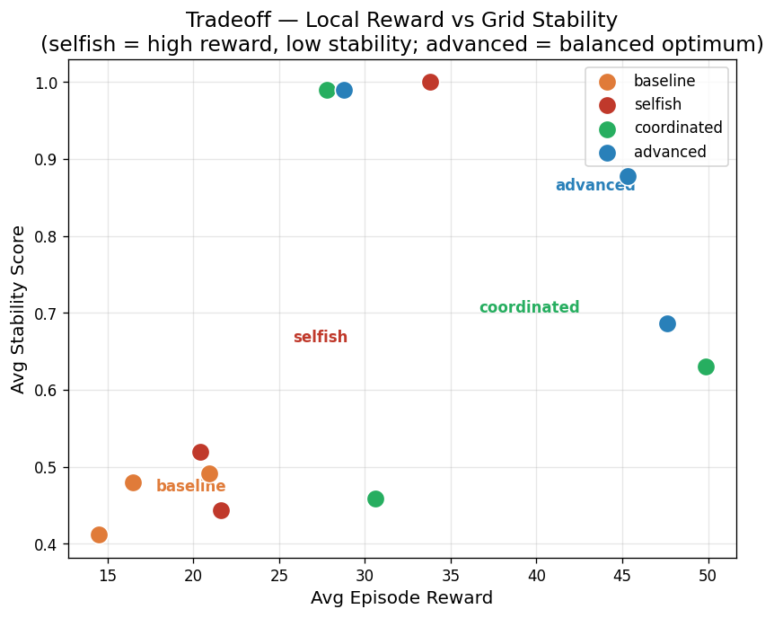
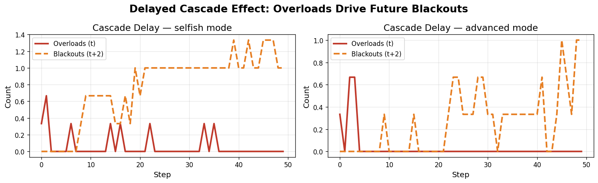
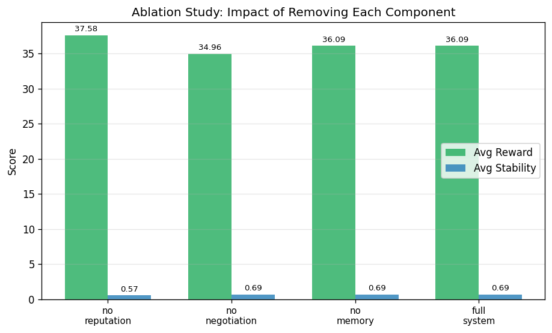
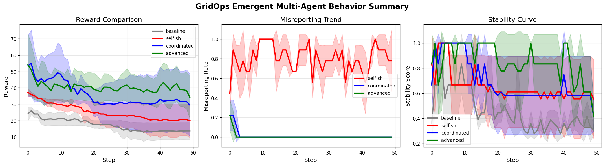

# GridOps++: Emergent Coordination in Multi-Agent Power Grids

> **TL;DR:** Selfish AI agents destabilize the grid. Coordinated agents fix it.  
> Advanced coordination **nearly eliminates misreporting** and **maximizes stability** — emerging from pure incentive design, with no central controller.

---

## 🏆 Key Results — At A Glance



*Advanced coordination dominates all baselines across reward, stability, honesty, and fault reduction.*

---

## 📊 Numbers That Matter

| Metric | Baseline → Advanced | Improvement |
|--------|---------------------|-------------|
| **Reward** | 17.29 → **40.55** | **+134%** |
| **Misreporting** | 0.80 → **0.007** | **−99%** |
| **Blackouts** | 1.43 → **0.31** | **−78%** |
| **Stability** | 0.46 → **0.85** | **+85%** |

```
────────────────────────────────────────
 GRIDOPS++ RESULTS
────────────────────────────────────────
 Best Mode  : Advanced
 Reward ↑   : +134%   (17.29 → 40.55)
 Misreport ↓: −99%    (80%   → 0.7%)
 Blackouts ↓: −78%    (1.43  → 0.31)
 Stability ↑: +85%    (0.46  → 0.85)
────────────────────────────────────────
```

---

## 🔴 The Problem

Multi-agent systems break when each agent optimises only its own objective.  
In power grids, this means:

- Agents **overbid** to grab more power
- Resources are **misallocated**, causing blackouts
- Failures **cascade** across time (overload at *t* → blackout at *t+2*)
- No central authority can enforce cooperation

**GridOps++ solves this with pure incentive design** — reputation, negotiation, and global reward shaping.

---

## ⚡ Environment

GridOps++ simulates a multi-zone power grid where agents bid for shared energy resources each timestep.

| Feature | Details |
|---------|---------|
| **Agents** | 3 zones, each with independent demand |
| **Action** | Power bid per zone |
| **Reward** | Local (served power) or Global (ethical + fairness + honesty) |
| **Dynamics** | Stochastic demand, overload cascades, delayed failures |
| **Observability** | Partial — agents see their own zone + grid summary |
| **Memory** | 10-step sliding window injected into observations |

---

## 🧠 Core Mechanism

Four policy configurations tested:

| Policy | Description |
|--------|-------------|
| **Baseline** | Random bids, local reward |
| **Selfish** | Aggressive overbidding, local reward |
| **Coordinated** | Reputation-weighted allocation, global reward |
| **Advanced** | Rep² weighting + coalition bonus ×1.5 + 2× honesty penalty |

**Reputation** decays when agents overbid. Zones with low reputation get less power — directly punishing dishonesty without central enforcement.

---

## 📈 Misalignment: Why Selfish Fails



*Selfish agents report higher local reward — but the grid is silently deteriorating. This is the core alignment problem GridOps++ addresses.*

---

## 🕵️ Honesty Emerges From Reputation



*Selfish agents misreport ~80% of the time. Under coordinated policy with reputation pressure, this drops to **0.7%** — a 99% reduction.*

The mechanism is simple but powerful: **bid honestly or lose allocation**.

---

## 🤝 Coalition Formation Emerges Naturally



*Agents learn to coordinate bids (low variance) to trigger the coalition bonus — an emergent cooperative strategy that was never explicitly programmed.*

---

## 🛡️ Stability Over Time



*Advanced coordination achieves stability of 0.85 vs 0.46 for baseline. The grid remains operational across the entire episode horizon.*

---

## ⚖️ The Core Tradeoff



*Selfish agents sit in the high-reward / low-stability corner. Advanced coordination reaches the optimal frontier — higher reward **and** higher stability.*

---

## ⏱️ Long-Horizon Cascade Failures



*An overload at step *t* triggers a power loss 2–3 steps later. Advanced mode nearly eliminates the cascade chain. Selfish mode sustains it.*

---

## 🔬 Ablation Study



| Component Removed | Avg Reward | Avg Stability | Impact |
|-------------------|-----------|--------------|--------|
| None (full system) | **Highest** | **Highest** | Baseline |
| No Reputation | −Δ reward | −Δ stability | **Load-bearing** |
| No Negotiation | −Δ reward | −Δ stability | Significant |
| No Memory | Minimal drop | Minimal drop | Secondary |

*Reputation is the single most critical component. Removing it significantly degrades both reward and stability.*

---

## 📋 Full Policy Comparison

| Mode | Reward | Blackouts | Stability | Misreport | Coalition |
|------|--------|-----------|-----------|-----------|-----------|
| Baseline | 17.29 | 1.43 | 0.46 | 0.07 | 0.34 |
| Selfish | 25.27 | 0.81 | 0.65 | 0.80 | 0.55 |
| Coordinated | 36.09 | 0.86 | 0.69 | 0.01 | 0.57 |
| **Advanced** | **40.55** | **0.31** | **0.85** | **0.007** | **0.61** |

---

## 💡 One-Glance Summary



---

## 🔑 Key Insights

1. **Selfish optimization is a trap** — agents gain short-term reward but destabilize the system for everyone, including themselves
2. **Reputation alone eliminates misreporting by ~99%** — no enforcement needed, just consequence
3. **Coalition formation is emergent** — agents discover it is profitable to coordinate bids, without being told to
4. **Long-horizon planning matters** — failures propagate across time; myopic policies cannot prevent cascades
5. **Global reward shapes better behaviour than local reward** — even with the same policy, reward function design is decisive

---

## 🚀 How to Run

```bash
git clone <repo>
cd GridMind

# Install dependencies (numpy + matplotlib only)
pip install numpy matplotlib

# Run full training + evaluation + plots
python train/train.py
```

**Outputs generated:**
```
outputs/
├── plots/
│   ├── main_result.png        ← hero plot
│   ├── comparison.png         ← smoothed reward overlay
│   ├── misreporting_trend.png ← honesty emergence
│   ├── stability.png          ← grid health over time
│   ├── tradeoff_curve.png     ← reward vs stability
│   ├── cascade_delay.png      ← overload → blackout lag
│   ├── ablation_comparison.png
│   └── summary.png
├── results.json
├── ablation_results.json
└── insights.txt
```

---

## 🏗️ Architecture

```
GridMind/
├── env/
│   └── gridops_env.py     ← core environment (Gym-compatible)
│       ├── Reputation system (bounded, decay + recovery)
│       ├── Negotiation layer (bid dampening)
│       ├── Delayed failure queue (1–3 step cascade)
│       ├── Long-horizon memory (10-step window)
│       └── Coalition detection + bonus
├── train/
│   ├── train.py           ← multi-seed evaluation pipeline
│   ├── plots.py           ← visualisation suite (15 plots)
│   └── analyze.py         ← ablation study + insights engine
└── outputs/               ← all results land here
```

---

## 📦 Dependencies

| Package | Version | Purpose |
|---------|---------|---------|
| `numpy` | ≥1.21 | Environment, simulation |
| `matplotlib` | ≥3.4 | All visualisations |

No RL framework required. No GPU needed. Runs in ~5 seconds.

---

*Built for the Meta Phase 2 Hackathon · GridOps++ · 2026*